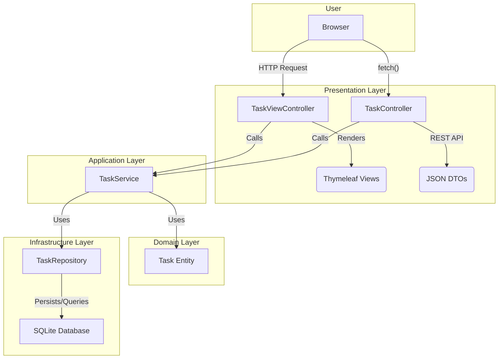
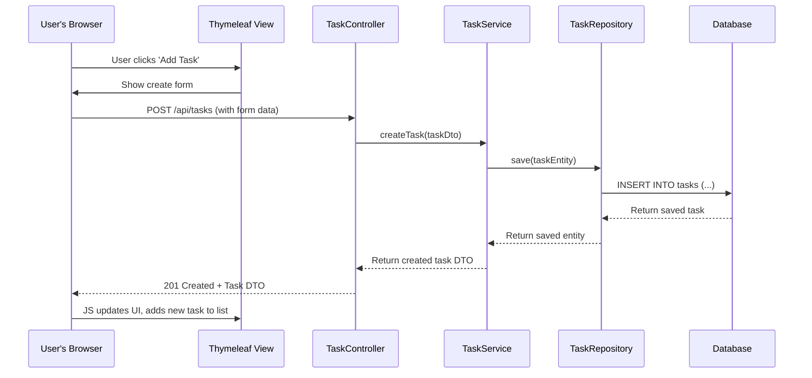

# High-Level Technical Design — Todo App (MVP)

This document outlines the technical design and architecture for the Todo App MVP, based on the finalized requirements and project plan. It is aligned with a Spring Boot backend and a Thymeleaf-based frontend.

## Tech Stack and Rationale

- **Backend**: Spring Boot 3.x (Spring Web, Spring Data JPA), Spring Validation, Jackson for JSON serialization, and SLF4J with Logback for logging. This stack was chosen for its rapid development capabilities, robust ecosystem, and alignment with modern Java development practices.

- **UI**: Thymeleaf for server-side templating, supplemented with vanilla JavaScript for client-side interactivity. This approach avoids the complexity of a full-fledged frontend framework, aligning with the MVP's goal of simplicity, while still enabling a responsive and dynamic user experience.

- **Tooling**:
  - **Build Tool**: Maven will be used for its ubiquitous support, declarative dependency management, and extensive plugin ecosystem.
  - **Testing**: The project will use a standard, proven testing stack:
    - **JUnit 5**: The latest standard for testing on the JVM.
    - **Mockito**: For creating mock objects to isolate components in unit tests.
    - **AssertJ**: To provide a fluent and highly readable assertion library.

## Architecture and Layering

The application will follow a classic, clean 4-layer architecture to ensure separation of concerns and maintainability.

- **Presentation Layer**: Contains `TaskController` (REST API) and `TaskViewController` (Thymeleaf views). This layer is responsible for handling HTTP requests, delegating to the application layer, and rendering the UI.
- **Application Layer**: The `TaskService` resides here. It orchestrates business logic, acting as a mediator between the presentation and domain/infrastructure layers. It handles transactions and DTO mapping.
- **Domain Layer**: Contains the core business model, primarily the `Task` entity. This layer is the heart of the application and has no dependencies on other layers.
- **Infrastructure Layer**: Includes `TaskRepository` (Spring Data JPA interface) and configurations for the database (SQLite/H2). It is responsible for all data persistence and other external concerns.

Dependencies will be managed via constructor-based Dependency Injection, managed by the Spring IoC container.

### Layered Architecture Diagram



## Data Model and Persistence

- **Task Entity**: The core `Task` entity will include the following fields:
  - `id` (UUID, Primary Key)
  - `title` (String, not null)
  - `description` (String, nullable)
  - `priority` (Enum: `LOW`, `MEDIUM`, `HIGH`)
  - `dueDate` (LocalDate, nullable)
  - `completed` (boolean)
  - `tags` (ElementCollection of Strings)
  - `createdAt`, `updatedAt` (Timestamps, managed by JPA)
  - `deletedAt` (Timestamp, for soft delete)
  - `version` (Integer, for optimistic locking via `@Version`)

- **Soft Delete**: Soft deletion will be implemented globally. The `Task` entity will be annotated with `@SQLDelete` to turn `DELETE` operations into `UPDATE`s that set the `deletedAt` field. A `@Where(clause = "deleted_at IS NULL")` annotation will ensure that all repository queries automatically exclude soft-deleted tasks.

- **Database Migration**: For the MVP, `spring.jpa.hibernate.ddl-auto=update` is acceptable for development with SQLite/H2. The design explicitly plans for a future migration to a more robust database like PostgreSQL, at which point a formal migration tool like Flyway or Liquibase will be introduced.

## API Design Conventions

- **Endpoints**:
  - `GET /api/tasks`: List, filter, sort, and paginate tasks.
  - `POST /api/tasks`: Create a new task.
  - `GET /api/tasks/{id}`: Get a single task by its ID.
  - `PUT /api/tasks/{id}`: Fully replace a task.
  - `PATCH /api/tasks/{id}`: Partially update a task (e.g., for toggling completion).
  - `DELETE /api/tasks/{id}`: Soft delete a task.

- **Query Parameters**: The list endpoint will support `page`, `pageSize`, `q` (search), `priority`, `tag`, `sort`, and `order` as defined in the requirements.

- **Error Handling**: A global `@ControllerAdvice` class will intercept exceptions and map them to RFC7807 `ProblemDetail` responses, ensuring consistent error handling. Validation errors (`MethodArgumentNotValidException`) will return a 400 status with a detailed `errors` map.

- **API Documentation**: `springdoc-openapi` will be integrated to automatically generate an OpenAPI 3.x specification from the code, available at `/v3/api-docs`.

## UI Architecture

- **Structure**: The UI will be built around a main `tasks/index.html` Thymeleaf template. This template will use `th:replace` or `th:include` to pull in fragments for the task list (`_taskList.html`) and the create/edit form (`_taskForm.html`).

- **JavaScript Modules**: Client-side logic will be organized into vanilla JS modules:
  - `apiClient.js`: A lightweight wrapper around the `fetch` API for communicating with the backend.
  - `taskManager.js`: Handles events for creating, updating, and deleting tasks. It will dynamically refresh the task list partial without a full page reload by fetching the rendered HTML fragment from a dedicated endpoint and replacing the content.
  - `filterManager.js`: Manages changes to filter/sort/search inputs and updates the URL using the History API to reflect the current state.

- **Progressive Enhancement**: The application will be functional with JavaScript disabled (server-side form submissions and full page reloads). When enabled, JavaScript will enhance the experience with AJAX-powered partial updates.

### Component and Create Flow Diagrams



```mermaid
C4Context
  title Component Diagram

  Container(web, "Web Application", "Spring Boot, Java") {
    Component(controller, "TaskController", "REST API Endpoints")
    Component(service, "TaskService", "Business Logic")
    Component(repository, "TaskRepository", "Data Access Layer")
    Component(view, "Thymeleaf Views", "HTML UI")
    Component(js, "Vanilla JS", "Client-Side Logic")
  }

  System_Ext(user, "User", "Manages tasks")
  SystemDb(db, "Database", "SQLite")

  Rel(user, view, "Views and interacts with")
  Rel(user, js, "Executes")
  Rel(js, controller, "Makes API calls to")
  Rel(view, controller, "Can submit forms to")
  Rel(controller, service, "Delegates to")
  Rel(service, repository, "Uses")
  Rel(repository, db, "Reads/Writes to")
```

## Cross-Cutting Concerns

- **Validation**: Bean Validation (`jakarta.validation.constraints.*`) will be used on DTOs. The `@Valid` annotation in the `TaskController` will trigger validation automatically.
- **Logging**: Structured JSON logging will be configured. A `Filter` will be implemented to manage a correlation ID (`X-Request-ID`), adding it to the SLF4J Mapped Diagnostic Context (MDC) so it appears in every log line for a given request.
- **Security**: Spring Security will be configured to:
  - Disable CORS (`.cors(AbstractHttpConfigurer::disable)`), as it's a same-origin app.
  - Enable standard security headers (HSTS, X-Frame-Options, etc.).
  - Disable CSRF and rely on same-origin policy for the MVP.
- **Health Endpoint**: The Spring Boot Actuator `/health` endpoint will be enabled.

## Testing Strategy

- **Unit Tests**: The `TaskService` and any utility classes will be unit-tested with JUnit 5 and Mockito. The repository layer will be mocked.
- **Integration Tests**: `@SpringBootTest` with `@AutoConfigureMockMvc` will be used to test the `TaskController`. These tests will send real HTTP requests to an in-memory version of the application and assert the correctness of responses, including status codes and `ProblemDetail` payloads.
- **UI Testing**: A manual testing checklist will be created and executed before each release to ensure the UI is functional on target browsers. Automated E2E testing is out of scope for the MVP.
